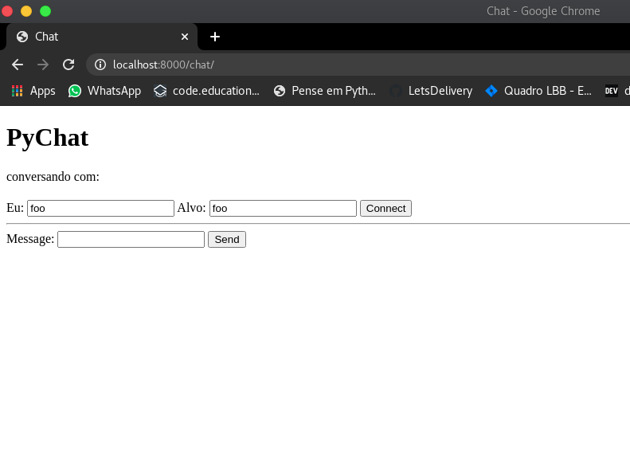
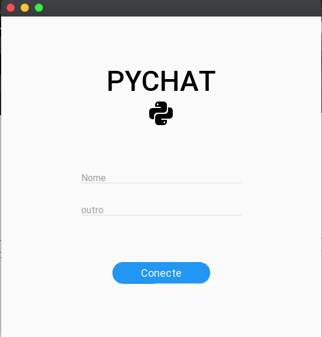
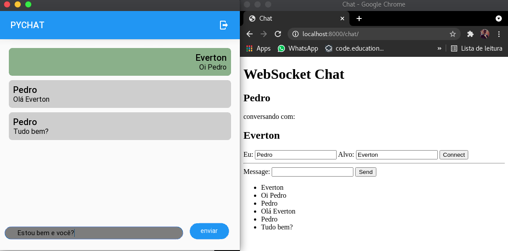
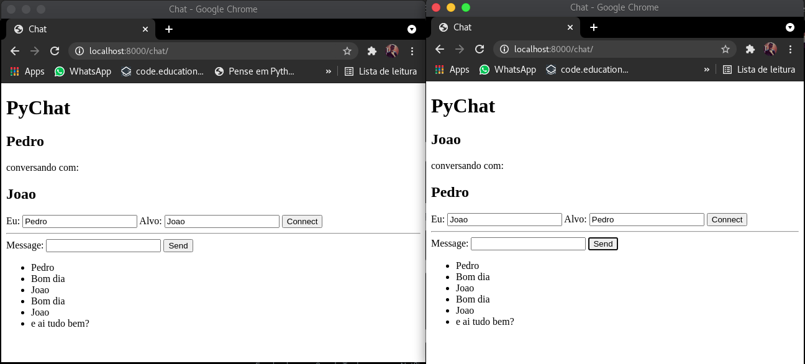

# PYCHAT

### Um simples chat em tempo real feito em python3.8, fastapi, websockets, kivy e kivymd.

## Como Usar?

1. Clone esse repositório.
2. Acesse a pasta.
3. Ative o virtual env.
4. Instale as dependências necessárias.
5. Rode o servidor web.
6. Acesse via seu navegador Web.
7. Ou Use o Aplicativo.
8. Acesse o diretório mobile.
9. Rode inicialize o aplicativo.
10. Digite seu nome e o nome com quem quer falar.

passos:

```
git clone git@github.com:dembinski2019/pychat.git
cd pychat
poetry shell
poetry install
uvicorn web.main:app --reload
```
Agora acesse em seu navegador http://localhost:8000/chat

O resultado esperado é esse:



Preencha o campo eu com seu nome e o campo alvo com o nome da pessoa com quem quer falar.

Após abra uma outra aba, e preencha com o nome da pessoa no campo eu e o seu nome no campo alvo.

Como opção também pode ser usado o app muiltiplataforma que pode ser copilado para windows, macOs, Iphone, Android e linux.

Mas para simplificar usaremos sem copilar, para isso basta rodar os seguintes comandos.

```
cd mobile
python app.py
```
O resultado será esse.



Preencha com seu nome o nome da pessoa com quem deseja falar.

Troca de mensagens entre aplicativo e navegador:



Troca de mensagens entre navegadores:


